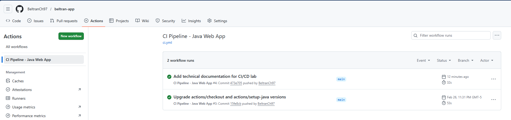
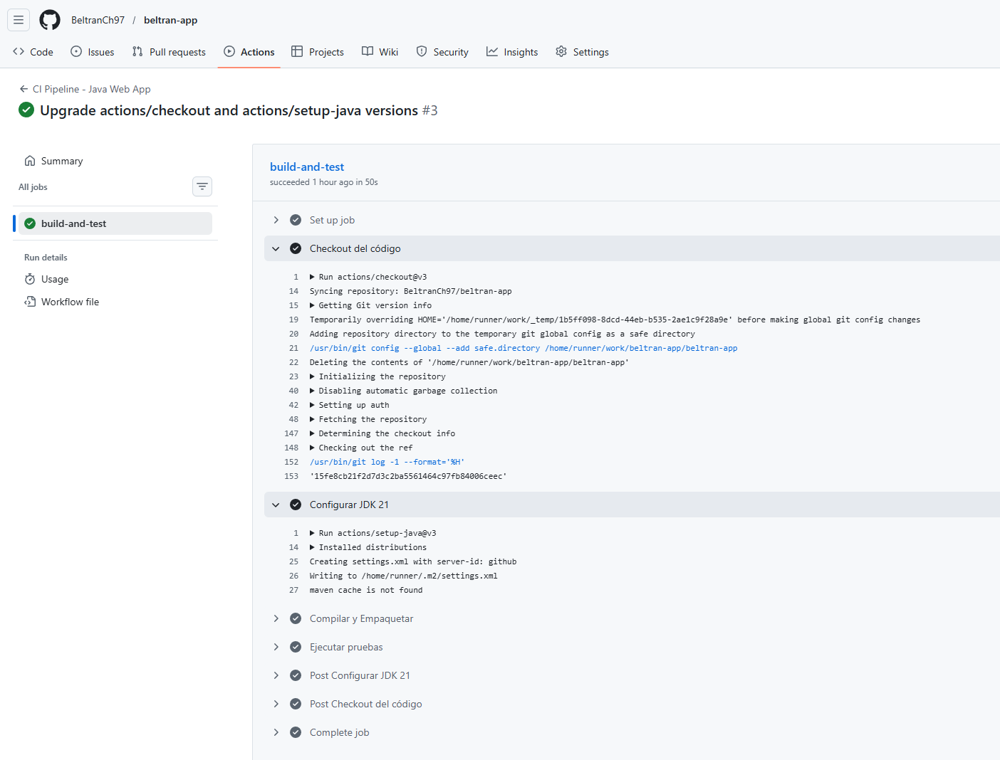
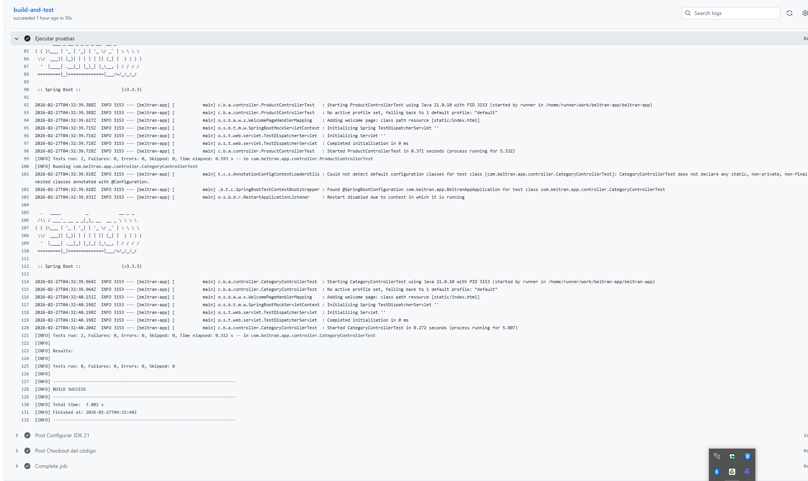
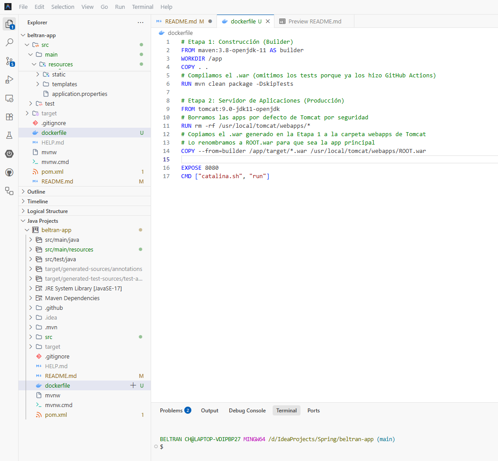

# Documento Técnico: Laboratorio CI/CD para Aplicación Java Web

**Nombre del Estudiante:** [Luis Fernando Beltran Chantre]  
**Módulo:** Flujos de entrega eficientes: CI/CD y automatización  
**Actividad:** Actividad 3 - Laboratorio Técnico  

---

## 1. Objetivo del Laboratorio
Diseñar, estructurar e implementar dos pipelines automatizados (CI y CD) para una aplicación web basada en Java. El objetivo es asegurar la integración continua mediante la compilación y pruebas del código, y la entrega continua mediante el empaquetado de la aplicación en un contenedor Docker con servidor Tomcat, preparándola para su futuro despliegue en Kubernetes.

## 2. Enlace al Repositorio
El código fuente, los archivos de configuración del pipeline y la documentación básica (`README.md`) se encuentran alojados en el siguiente repositorio público:  
🔗 **[https://github.com/BeltranCh97/beltran-app]**

---

## 3. Justificación Técnica y Arquitectura del Pipeline

Para este laboratorio se diseñó una arquitectura robusta orientada a entornos corporativos Java, integrando herramientas de revisión de código, seguridad y despliegue continuo en clústeres.

> 📄 **Documentación Detallada:** Para una explicación extensa de la integración, justificación de herramientas, y estrategias de automatización y reutilización del pipeline, consulta el nuevo documento técnico completo en [**CI_CD_PIPELINE.md**](./CI_CD_PIPELINE.md).

1. **Integración Continua (CI) y Empaquetado - GitHub Actions:**
   GitHub Actions maneja el ciclo inicial. Ante cada `push` o `pull_request` en `main`, compila el artefacto con **Java JDK 17** y **Maven**, ejecuta pruebas automatizadas, y lanza análisis de seguridad estática iterativos con **Snyk** y **SonarCloud** (SAST/SCA). Finalmente, empaqueta el artefacto `.war` en una imagen **Docker** de Apache Tomcat y la sube al repositorio central de **DockerHub**.

2. **Entrega Continua (CD) - Jenkins y Kubernetes:**
   Jenkins se reconfiguró para actuar como orquestador de entregas a entornos productivos. Mediante el uso de un `Jenkinsfile`, recoge los manifiestos de **Kubernetes** actualizados y reaplica los cambios al clúster (refrescando los pods con la imagen recién subida con la etiqueta `latest`), logrando sincronía total entre el código base y la infraestructura desplegada con cero fricción manual.

---

## 4. Archivos de Configuración

A continuación, se evidencian los archivos de configuración alojados en el repositorio que definen la infraestructura como código de los pipelines:

### 4.1. Pipeline CI (GitHub Actions)
**Ruta:** `.github/workflows/ci.yml`

```yaml
name: CI Pipeline - Java Web App

on:
  push:
    branches: [ "main" ]
  pull_request:
    branches: [ "main" ]

jobs:
  build-and-test:
    runs-on: ubuntu-latest

    steps:
    - name: Checkout del código
      uses: actions/checkout@v3

    - name: Configurar JDK 21
      uses: actions/setup-java@v3
      with:
        java-version: '21'
        distribution: 'temurin' 
        cache: maven

    - name: Compilar y Empaquetar el artefacto (.war)
      run: mvn clean package

    - name: Ejecutar pruebas unitarias
      run: mvn test
```
### 4.2. Dockerfile
**Ruta:** `/`
```
# Etapa 1: Construcción (Builder)
FROM maven:3.8-openjdk-11 AS builder
WORKDIR /app
COPY . .
RUN mvn clean package -DskipTests

# Etapa 2: Servidor de Aplicaciones (Producción)
FROM tomcat:9.0-jdk11-openjdk
RUN rm -rf /usr/local/tomcat/webapps/*
COPY --from=builder /app/target/*.war /usr/local/tomcat/webapps/ROOT.war
EXPOSE 8080
CMD ["catalina.sh", "run"]
```
### 4.3. Pipeline CD (Jenkins)
**Ruta:** `/`
```
pipeline {
    agent any

    environment {
        DOCKER_IMAGE = 'mi-usuario/java-webapp-tomcat'
        DOCKER_TAG = 'latest'
        DOCKER_CREDS = credentials('dockerhub-credentials-id') 
    }

    stages {
        stage('1. Clonar el repositorio') {
            steps {
                echo 'Clonando repositorio de GitHub...'
                checkout scm
            }
        }

        stage('2. Construir imagen Docker') {
            steps {
                echo 'Construyendo imagen con Tomcat y el archivo .war...'
                sh "docker build -t ${DOCKER_IMAGE}:${DOCKER_TAG} ."
            }
        }

        stage('3. Publicar en DockerHub') {
            steps {
                echo 'Publicando la imagen de la Web App en el registro...'
                sh "echo \$DOCKER_CREDS_PSW | docker login -u \$DOCKER_CREDS_USR --password-stdin"
                sh "docker push ${DOCKER_IMAGE}:${DOCKER_TAG}"
            }
        }
    }
}
```
---
## 5. Evidencias de Ejecución
### 5.1. Pipeline CI (GitHub Actions)

---

---

---
### 5.2. Pipeline CD (Jenkins)

---
## 6. Conclusión 🏆🏆🏆
La implementación de este laboratorio demuestra cómo las prácticas DevOps transforman el ciclo de vida del desarrollo de software. Al automatizar la compilación con GitHub Actions y el empaquetado del contenedor con Jenkins, se elimina el trabajo manual propenso a errores, se asegura la calidad del código Java desde el inicio y se estandariza el entorno de ejecución mediante Tomcat y Docker, cumpliendo a cabalidad con los principios de integración y entrega continua.
